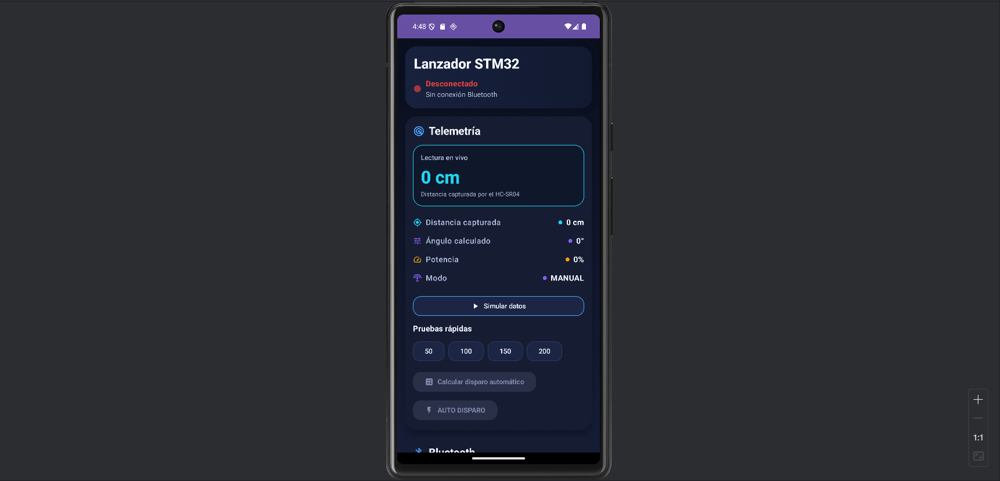
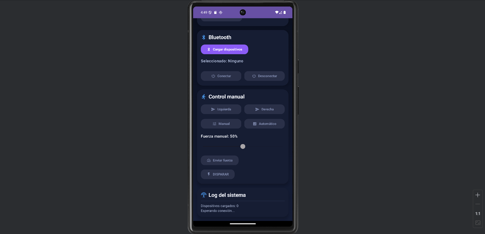

# Torreta STM32 + Android

Proyecto académico de **Sistemas Embebidos** desarrollado en la **Universidad Iberoamericana Ciudad de México**.

El sistema integra una aplicación Android con una torreta física controlada mediante un microcontrolador **STM32 Blue Pill**. La comunicación se realiza por Bluetooth utilizando un módulo **HC-05**, permitiendo enviar comandos desde el teléfono y recibir telemetría del sistema.

---

## Capturas de la aplicación

### Telemetría y estado del sistema



### Bluetooth y control manual



---

## Funcionalidades

- Conexión Bluetooth mediante HC-05.
- Búsqueda y selección de dispositivos Bluetooth.
- Control manual de movimiento de la torreta.
- Movimiento hacia izquierda y derecha.
- Activación del mecanismo de disparo.
- Cambio entre modo manual y automático.
- Control de fuerza desde la aplicación.
- Recepción de telemetría desde el STM32.
- Lectura de distancia mediante HC-SR04.
- Visualización del estado de conexión.
- Registro de eventos mediante un log dentro de la aplicación.
- Herramientas de simulación para pruebas de interfaz.

---

## Tecnologías

### Aplicación Android

- Kotlin
- Jetpack Compose
- Android SDK
- Android Studio
- Bluetooth
- ViewModel
- Material Design
- Gradle Kotlin DSL

### Sistemas embebidos

- STM32 Blue Pill
- C
- UART
- PWM
- HC-05 Bluetooth
- HC-SR04
- Servomotor
- Motor DC 775
- Driver L298N

---

## Arquitectura del sistema

La aplicación Android envía comandos al STM32 mediante Bluetooth utilizando el módulo HC-05.

El flujo general de comunicación es:

```text
Aplicación Android
Bluetooth
HC-05
UART
STM32
Sensores y actuadores
```

El STM32 procesa los comandos recibidos y controla los componentes físicos del sistema. También envía información de telemetría de regreso a la aplicación.

---

## Comunicación Bluetooth

La aplicación Android se comunica con el STM32 mediante el módulo HC-05 utilizando comunicación serial UART a 9600 bps.

El sistema utiliza comandos de un carácter para ejecutar acciones.

| Comando | Acción |
|---|---|
| `L` | Mover la torreta a la izquierda |
| `R` | Mover la torreta a la derecha |
| `S` | Activar el disparo |
| `M` | Cambiar a modo manual |
| `A` | Cambiar a modo automático |

El STM32 también puede enviar telemetría de regreso a la aplicación.

Ejemplo:

```text
D:45
```

En este caso, `45` representa la distancia medida en centímetros.

---

## Componentes principales

| Componente | Función |
|---|---|
| STM32 Blue Pill | Control principal del sistema |
| HC-05 | Comunicación Bluetooth con Android |
| HC-SR04 | Medición de distancia |
| Servomotor | Movimiento horizontal |
| Motor DC 775 | Mecanismo de disparo |
| L298N | Control del motor DC |
| Aplicación Android | Interfaz de control y telemetría |

---

## Estructura de la aplicación

```text
app/src/main/java/com/example/lanzadorstm32/

├── MainActivity.kt
├── bluetooth/
│   └── BluetoothService.kt
├── ui/
│   └── ControlScreen.kt
└── viewmodel/
    └── MainViewModel.kt
```

### MainActivity

Punto de entrada de la aplicación Android.

### BluetoothService

Gestiona la conexión y comunicación Bluetooth con el módulo HC-05.

### ControlScreen

Contiene la interfaz principal para telemetría, conexión Bluetooth y control de la torreta.

### MainViewModel

Administra el estado de la interfaz y conecta la capa visual con las funciones de control y comunicación.

---

## Mi contribución

### Jorge Emmanuel Roldán Márquez

Mi participación se enfocó principalmente en el **desarrollo de software y la integración hardware/software**.

Me encargué de:

- Desarrollo de la aplicación Android en Kotlin.
- Desarrollo de la interfaz de control.
- Implementación de la comunicación Bluetooth.
- Integración con el módulo HC-05.
- Programación de comandos enviados al STM32.
- Recepción y visualización de telemetría.
- Integración del software con el microcontrolador.
- Conexión e integración de los componentes electrónicos.
- Configuración y pruebas de comunicación UART.
- Integración del servomotor, sensor ultrasónico y sistema de disparo.
- Pruebas y depuración del sistema completo.

---

## Colaborador

### Jorge Olaf Quijas Pérez

Su participación se enfocó principalmente en:

- Diseño y construcción física de la torreta.
- Apoyo en la selección de componentes de hardware.
- Construcción y adaptación de la estructura mecánica.
- Colaboración durante las pruebas e integración del sistema.

---

## Documentación

El reporte técnico completo del proyecto se encuentra dentro del repositorio:

[Ver reporte técnico](docs/reporte-torreta-ibero.pdf)

El documento incluye:

- Descripción general del sistema.
- Componentes utilizados.
- Conexiones eléctricas.
- Comunicación Bluetooth.
- Protocolo de comandos.
- Control mediante PWM.
- Lectura del sensor ultrasónico.
- Comunicación UART.
- Fotografías del prototipo.

---

## Instalación

Clonar el repositorio:

```bash
git clone https://github.com/rzxldz/Torreta-STM32-Android.git
```

Abrir el proyecto en **Android Studio**.

Sincronizar las dependencias de Gradle.

Ejecutar la aplicación en un dispositivo Android compatible.

Para utilizar las funciones Bluetooth y controlar la torreta física es necesario contar con el hardware correspondiente.

---

## Estado del proyecto

El proyecto cuenta con una aplicación Android funcional para:

- Control de la torreta.
- Conexión Bluetooth.
- Envío de comandos.
- Recepción de telemetría.
- Control manual.
- Operación automática.
- Visualización del estado del sistema.

---

## Autores

**Jorge Emmanuel Roldán Márquez**  
Software e integración hardware/software

**Jorge Olaf Quijas Pérez**  
Construcción física y apoyo en selección de hardware

**Universidad Iberoamericana Ciudad de México**  
Sistemas Embebidos · 2025
